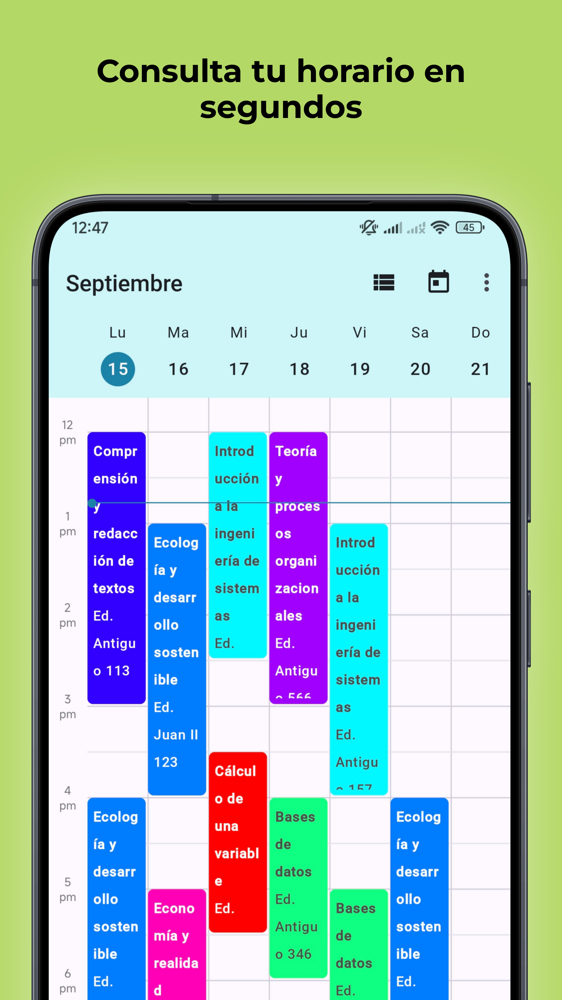
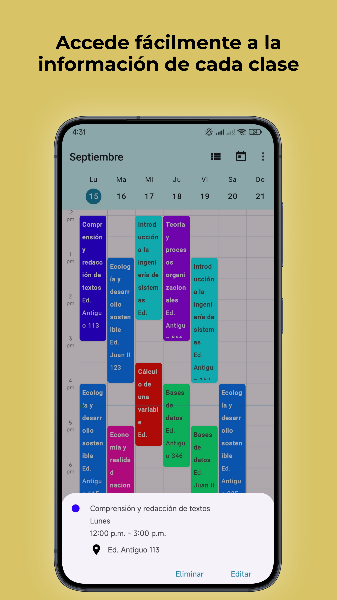
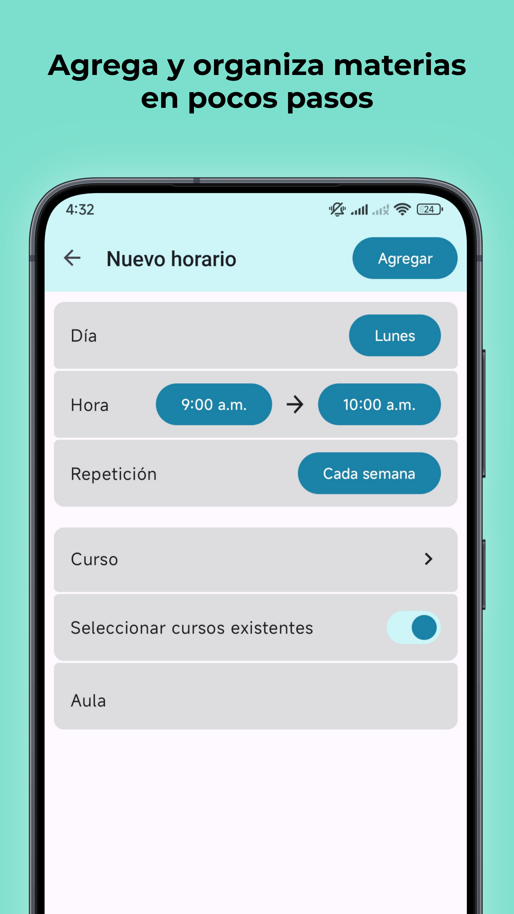
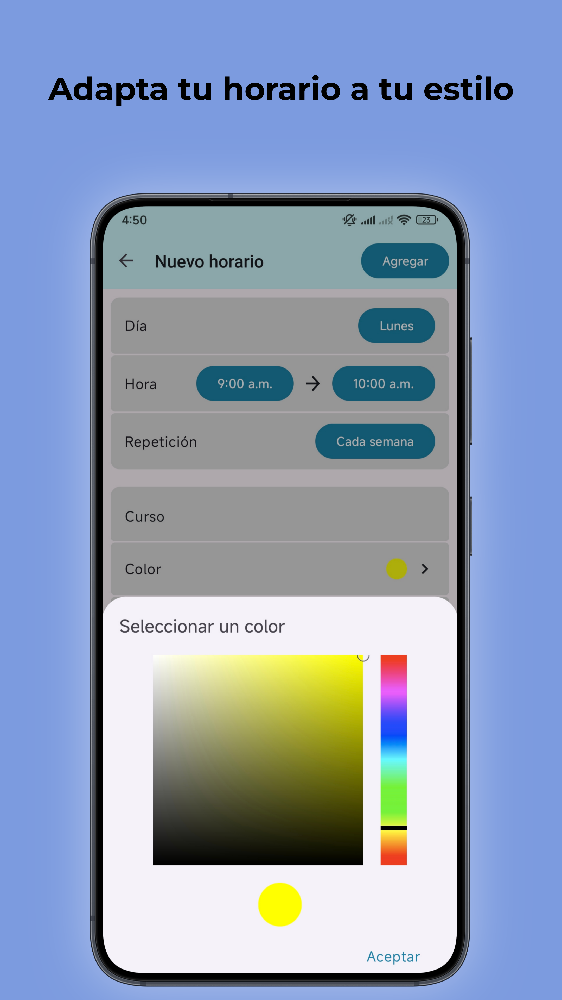
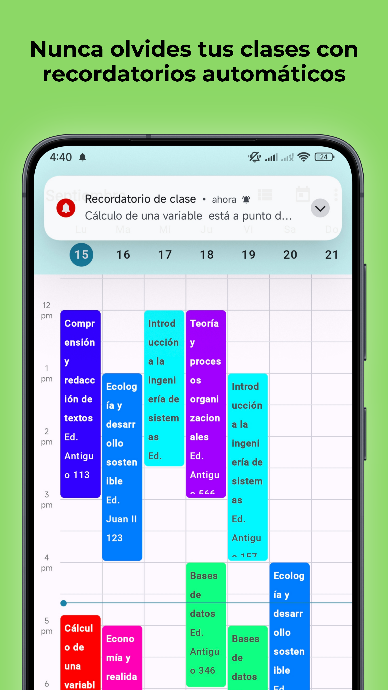
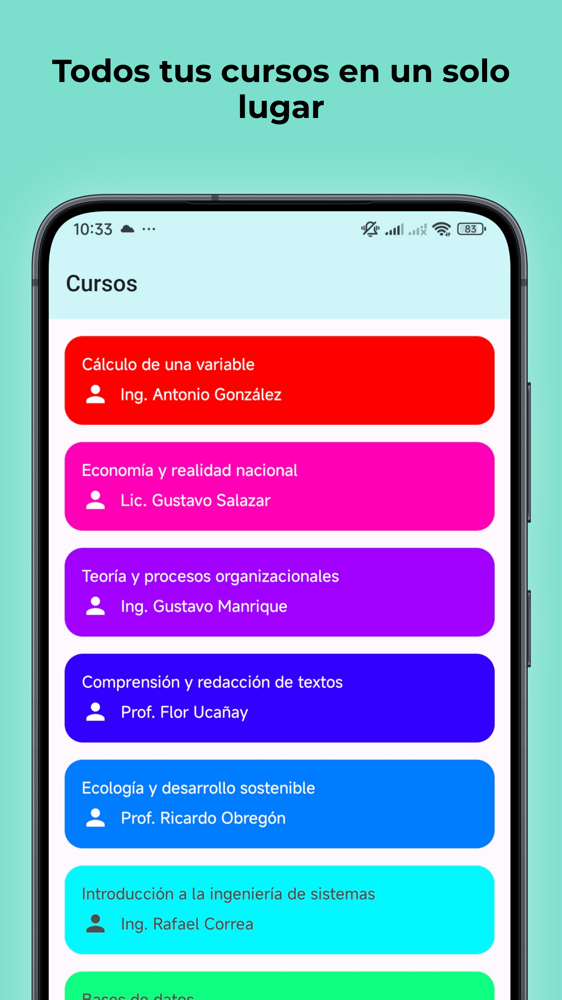
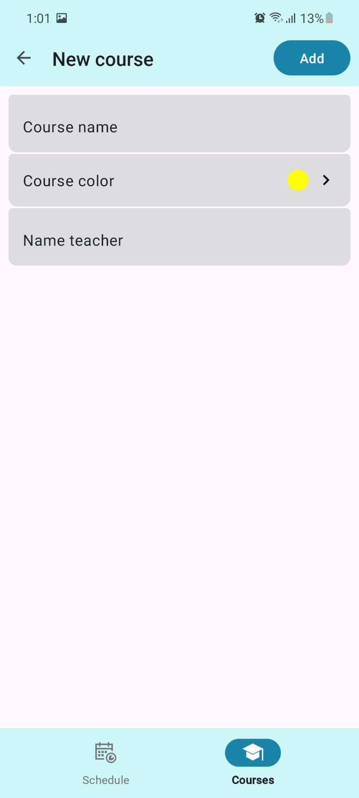
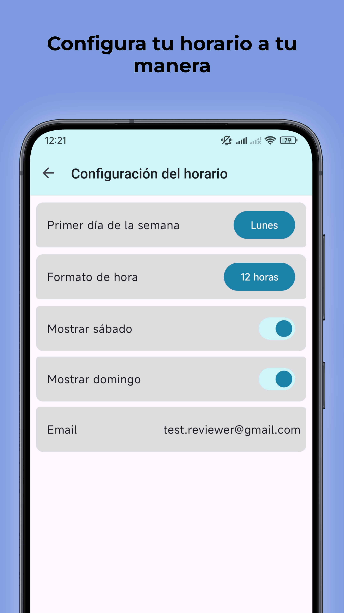

# Mi Horario Universitario (University Schedule)

## Acerca de la aplicación

**Mi Horario Universitario** es una aplicación Android diseñada para ayudar a los estudiantes a organizar su vida académica.
La app permite registrar horarios de clases, gestionar cursos, mantener información de los profesores y recibir notificaciones de los próximos eventos académicos.

La aplicación está construida bajo un enfoque offline-first, lo que significa que toda la información de cursos y horarios se guarda primero en una base de datos local en el dispositivo y luego se sincroniza automáticamente con la nube cuando hay conexión a Internet.
Gracias a esto, los usuarios pueden acceder a su información desde cualquier dispositivo Android iniciando sesión con su cuenta de Google o con usuario y contraseña.

## Características principales

- **Gestión de horarios**: agrega, visualiza y organiza tus horarios de clase.
- **Gestión de cursos**: administra cursos con detalles completos.
- **Directorio de profesores**: guarda y consulta información de docentes.
- **Sincronización en la nube**: accede a tus cursos y horarios desde cualquier dispositivo mediante tu cuenta.
- **Modo offline-first**: los datos se almacenan localmente y se sincronizan cuando hay conexión.
- **Notificaciones**: recordatorios automáticos antes del inicio de cada clase.
- **Personalización**: configura el formato de hora (12h/24h), día de inicio de semana, vistas en cuadrícula o lista, entre otras.
- **Inicio de sesión**: autenticación con Google o con correo/contraseña gracias a Firebase Authentication.
- **Anuncios**: integración de Google AdMob.
- **Monitoreo de fallos**: integración de Firebase Crashlytics para la gestión de errores en producción.
- **Control de versiones**: uso de Firebase Remote Config para el forzado de actualizaciones.
- **UI moderna**: migración progresiva de la interfaz a Jetpack Compose con Material 3.

## Arquitectura

La app sigue las [guías oficiales de arquitectura de Android](https://developer.android.com/topic/architecture), asegurando separación de responsabilidades y facilitando mantenibilidad y pruebas.
- **MVVM (Model-View-ViewModel)**: separación de lógica de negocio y UI.
- **ViewModel + Flows + LiveData**: manejo de datos reactivos y observables.
- **Patrón Repository**: acceso limpio y desacoplado a datos locales y remotos.
- **Room Database**: almacenamiento local persistente.
- **WorkManager**: sincronización en segundo plano de operaciones pendientes.

## Modularización

El proyecto está estructurado en múltiples módulos para mejorar escalabilidad y mantenibilidad, siguiendo las [guías oficiales de modularización de Android](https://developer.android.com/topic/modularization).

- **App Module**: punto de entrada de la aplicación, incluye Splash, RemoteConfigHelper y lógica de forzado de versiones.
- **Core Modules**:
  - **Common**: utilidades compartidas y manejo de sesiones con Firebase Auth.
  - **Data**: sincronización de datos locales y en la nube mediante workers.
  - **Database**: operaciones locales con Room.
  - **Datastore**: almacenamiento de preferencias.
  - **DesignSystem**: componentes de UI reutilizables.
  - **Model**: modelos de datos con soporte para offline-first.
  - **Network**: acceso a servicios en la nube de Firebase (Firestore).
  - **UI**: temas y componentes visuales (incluyendo soporte Compose).
- **Feature Modules**:
  - **Course**: gestión de cursos.
  - **Schedule**: gestión y visualización de horarios (incluye vistas en Compose).
  - **Login**: autenticación con Google y correo/contraseña.
- **Sync Module**: sincronización de datos entre nube y base local.
- **Build-Logic**: configuraciones centralizadas de Gradle.
- **Testing Modules**: utilidades para pruebas unitarias, de integración y de UI.

## Tecnologías principales

- **Kotlin**
- **Jetpack Compose + Views (migración progresiva)**
- **Firebase (Auth, Firestore, Crashlytics, Remote Config, Analytics)**
- **Google AdMob**
- **Room Database**
- **WorkManager**
- **Coroutines + Flows**
- **Hilt (Inyección de dependencias)**
- **JUnit, Robolectric, Espresso, MockK**

## Interfaz de usuario

La app ofrece una interfaz moderna y personalizable:
- **Material 3** con soporte para tema claro y oscuro.
- Vistas en **lista y cuadrícula** para horarios.
- Pantallas de configuración personalizables.
- Migración progresiva a **Compose** para una experiencia más fluida.

### Screenshots

*Visualización de horarios*

*Detalle de los horarios*

*Agregar horario*

*Personalización de los horarios*

*Recordatorio de los horarios*

*Visualización de cursos*

*Agregar Cursos*

*Configuración del horario*

