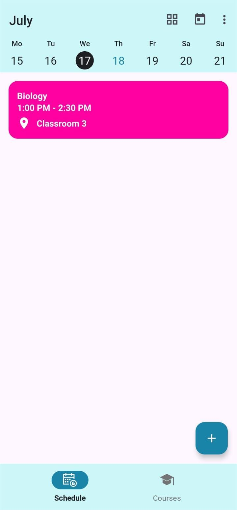
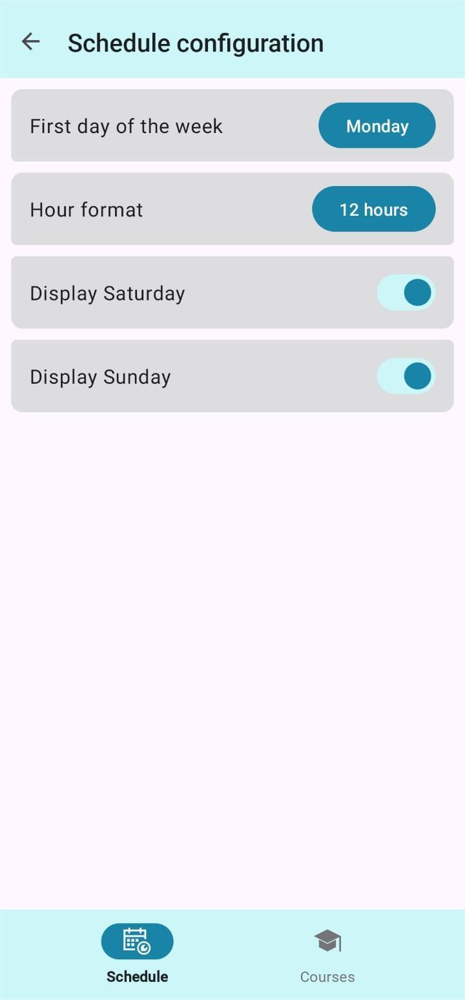

# University Schedule

## About the App

**University Schedule** is an Android application designed to help students organize their academic lives. The app allows students to register their class schedules, manage the courses they are enrolled in, and keep track of their professors. It is a comprehensive tool aimed at enhancing the student experience by providing a centralized platform for academic scheduling.

## Features

- **Class Schedule Management**: Easily add and view class schedules.
- **Course Management**: Keep track of courses with detailed information.
- **Professor Directory**: Store and manage information about professors.
- **User-Friendly Interface**: Intuitive design for a seamless user experience.
- **Notifications**: Receive reminders for upcoming classes and events.

### Screenshots

*Home Screen*

*Add Course*

*Add Schedule*

*Courses*

*Schedule Configuration*

## Architecture

The **University Schedule** app follows the [official architecture guidance](https://developer.android.com/topic/architecture), ensuring a clear separation of concerns and facilitating maintainability and testability. The architecture leverages:
- **ViewModel**: Manages UI-related data in a lifecycle-conscious way.
- **Kotlin Flows**: For asynchronous data streams, ensuring efficient and reactive handling of data updates.
- **LiveData**: Provides observable data holder classes.
- **Repository Pattern**: Manages data operations and provides a clean API to the ViewModel.
- **Room Database**: For local data storage.

## Modularization

University Schedule is structured into several modules to enhance scalability and maintainability, following the [official modularization guide](https://developer.android.com/topic/modularization) from the Android Developer website. The modules are:

- **App Module**: The main entry point of the application.
- **Build-Logic Module**: Contains the convention module for build configurations.
- **Core Module**: Encapsulates the following sub-modules:
  - **Common**: Shared utilities and constants.
  - **Data-Test**: Testing utilities for the data layer.
  - **Data**: Manages data sources.
  - **Database-Test**: Testing utilities for database interactions.
  - **Database**: Manages local database operations.
  - **Datastore-Test**: Testing utilities for data storage.
  - **Datastore**: Manages data storage operations.
  - **DesignSystem**: Custom UI components and design system elements.
  - **Model**: Defines data models.
  - **Testing**: Shared testing utilities and configurations.
  - **UI**: User interface components.
- **Feature Module**: Encapsulates feature-specific logic with the following sub-modules:
  - **Course**: Manages course-related features.
  - **Schedule**: Manages scheduling features.
- **UI-Test-Hilt-Manifest Module**: Configuration for UI tests using Hilt.

## Testing

The app employs a comprehensive testing strategy utilizing several libraries to ensure robust and reliable code:
- **JUnit**: For unit testing.
- **Robolectric**: For running Android tests on the JVM.
- **Espresso**: For UI testing.
- **MockK**: For mocking dependencies.
- **Hilt**: For dependency injection in tests.

## UI

The user interface of University Schedule is built using Material 3 components and Views, ensuring a modern and consistent design. Key UI elements include:
- **Material 3 Components**: For a cohesive and responsive design.
- **Custom Views**: Tailored to the specific needs of the app for a unique user experience.
